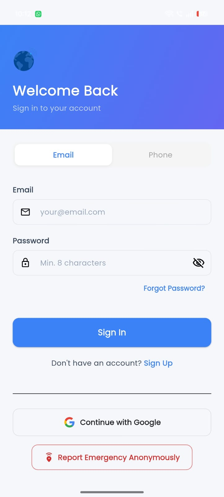
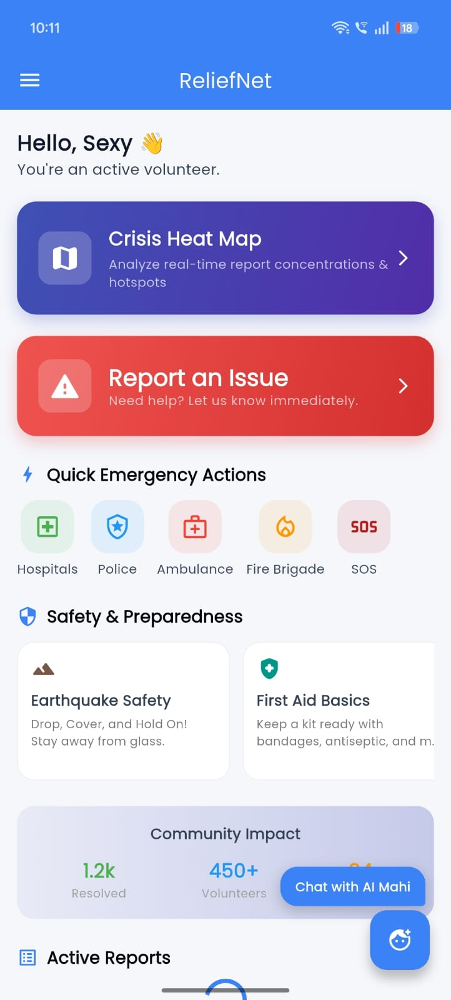
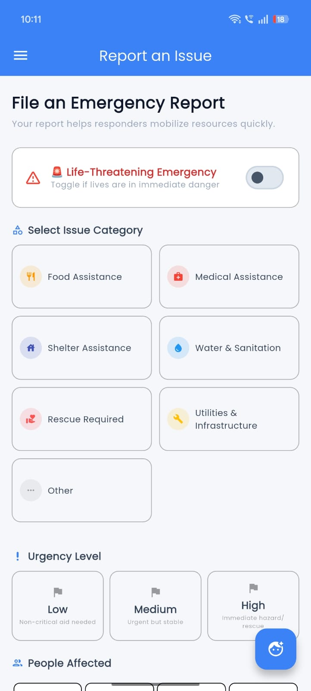
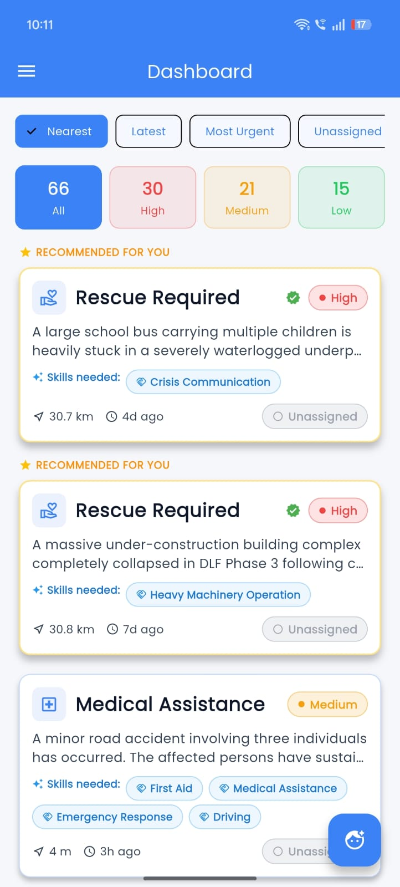
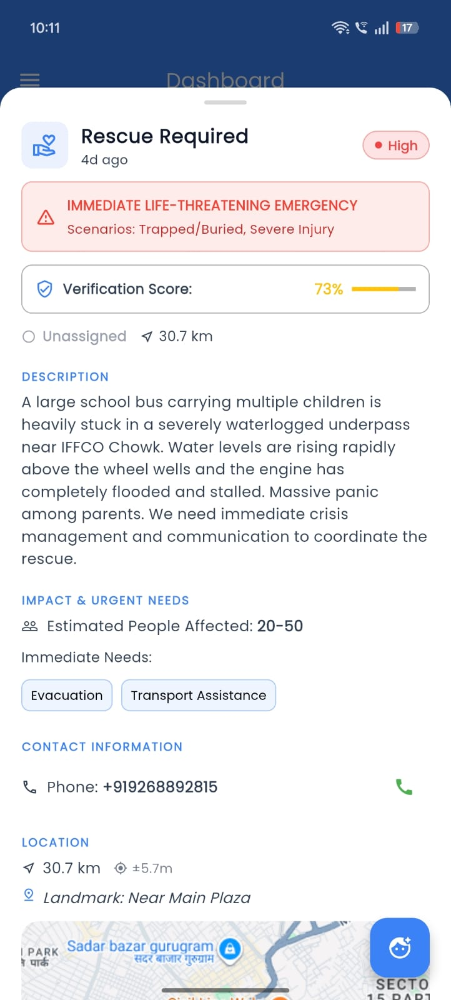
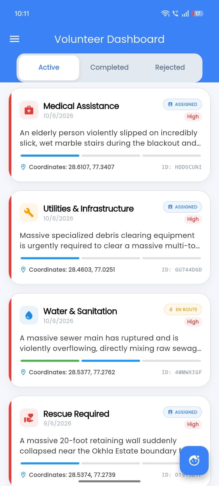
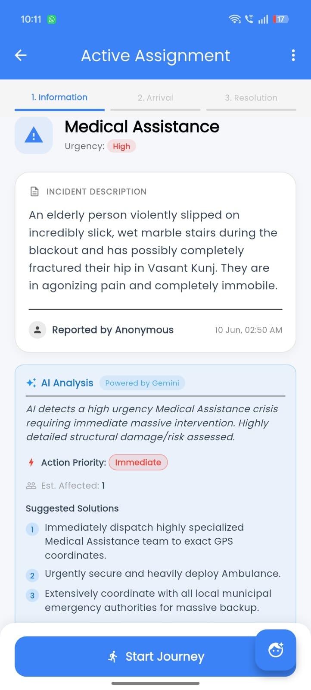
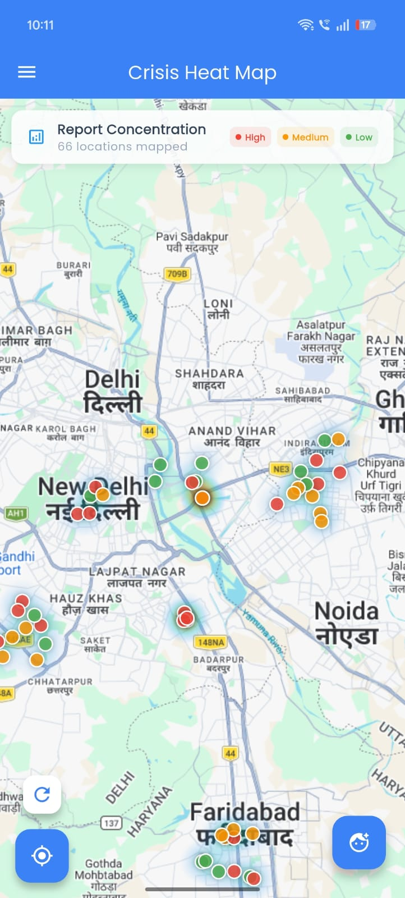

<div align="center">

<br />

<pre>
██████╗ ███████╗██╗     ██╗███████╗███████╗███╗   ██╗███████╗████████╗
██╔══██╗██╔════╝██║     ██║██╔════╝██╔════╝████╗  ██║██╔════╝╚══██╔══╝
██████╔╝█████╗  ██║     ██║█████╗  █████╗  ██╔██╗ ██║█████╗     ██║   
██╔══██╗██╔══╝  ██║     ██║██╔══╝  ██╔══╝  ██║╚██╗██║██╔══╝     ██║   
██║  ██║███████╗███████╗██║███████╗██║     ██║ ╚████║███████╗   ██║   
╚═╝  ╚═╝╚══════╝╚══════╝╚═╝╚══════╝╚═╝     ╚═╝  ╚═══╝╚══════╝   ╚═╝   
</pre>

**NGO field reporting & volunteer dispatch — powered by Gemini AI**

<a href="https://promptwars.in/solutionchallenge2026.html" target="_blank" rel="noopener"></a>
<a href="https://flutter.dev" target="_blank" rel="noopener"></a>
<a href="https://firebase.google.com" target="_blank" rel="noopener"></a>
<a href="https://ai.google.dev" target="_blank" rel="noopener"></a>
<a href="https://github.com/your-username/reliefnet/releases" target="_blank" rel="noopener"></a>

<br />

</div>

---

## ✨ What's New in v2.0.0

**Tier 1 — Core Operations**
- **NGO Coordinator Web Portal**: Admin dashboard showing real-time emergency reports on maps/charts, letting coordinators assign volunteers and export data.
- **Volunteer Task Wizard + Geofencing**: 3-step flow guiding volunteers. Mandates 1km GPS geofence verification and on-site photo/video proof to prevent fake completions.
- **Offline Mode + Auto-Sync**: Submit reports without internet. App saves locally and uploads automatically once connectivity returns.

**Tier 2 — AI Validation & Citizen Enhancements**
- **Multi-Modal AI Credibility Engine**: Gemini cross-checks text and media for spam (rejecting memes/gibberish) and generates a credibility score.
- **Phone OTP Verification**: Verifies real users to block anonymous abuse.
- **AI Form Suggestions + Verification Score**: Gemini runs in the background suggesting category/urgency and provides a live completeness score (0-100%).
- **Mahi AI Chatbot**: Floating chatbot giving immediate, calm safety advice (flood, earthquake, medical) while help is on the way.

**Tier 3 & 4 — Advanced Tools & Security**
- **Crisis Heatmap**: Map overlay visualizing clustering emergencies, color-coded by urgency.
- **Hospital Directory + Details Sheet**: Nearby hospitals with distance, ratings, map previews, and direct calling.
- **Welcome Onboarding & Role Selector**: Animated intro screens to pick roles (Reporter, Volunteer, NGO Admin) to customize the UI.
- **Multi-Language i18n**: Full UI support for English, Hindi (HI), and Punjabi (PA).
- **Firebase App Check**: Backend security using DeviceCheck & Play Integrity to block illegitimate database writes.
- **Math Anti-Spam Captcha**: Simple math challenge stopping bots from flooding the system.

---

## What is ReliefNet?

ReliefNet bridges the gap between **disaster-affected communities** and **verified NGO field volunteers**. When a crisis hits — food shortage, medical emergency, shelter need — anyone can file a geo-tagged report in seconds. Verified volunteers nearby see it on a live dashboard, accept the task, navigate to the site, and submit photo proof on completion.

By replacing manual coordination with intelligent dispatch, ReliefNet cuts crisis response time from hours to minutes, ensuring help reaches affected communities faster.

---

## 💡 Why ReliefNet? (Our USP)

**How is it different from existing platforms?**
- **AI-Powered Validation**: Unlike traditional platforms that rely on manual verification, ReliefNet uses a Multi-Modal AI Engine to instantly cross-check text with uploaded images/videos, filtering out spam and fake reports automatically.
- **Zero-Network Resilience**: Most emergency apps fail when cell towers go down. ReliefNet allows offline reporting by saving drafts locally and syncing them to the cloud the moment an internet connection is restored.
- **Geofenced Accountability**: Enforces a 1km GPS Geofence verification, ensuring volunteers are physically at the crisis site before they can claim a task as resolved.

**How does it solve the problem?**
- **Eliminates Information Overload**: AI instantly scores report credibility, allowing NGO coordinators to focus only on genuine crises.
- **Optimizes Resource Allocation**: Real-time GIS heatmaps and AI form suggestions match the right volunteers to the right emergencies based on exact proximity and required skills.
- **Centralizes Coordination**: The new Web Portal provides a single dashboard to monitor active emergencies, review volunteer applications, and track resolution metrics in real-time.

Every report is instantly analyzed by **Gemini AI** to surface urgency insights, required skills, and actionable solutions — before a single volunteer is dispatched.

---

## 📥 Download App

Get the latest version of **ReliefNet APK**:

👉 <a href="https://github.com/ReliefNet/ReliefNet/releases/download/v2.0.0/reliefnet-v2.0.0.apk" target="_blank" rel="noopener">Download Latest APK</a>

> ⚠️ Enable "Install from unknown sources" on your Android device before installing.

---

## 🎥 Demo Video

Watch ReliefNet in action:

<a href="https://www.youtube.com/watch?v=G4vIh2EdpCw" target="_blank" rel="noopener"></a>

---

## 📊 Pitch Deck

View our Google Solution Challenge 2026 presentation:

👉 <a href="https://canva.link/pwl8j4vw56z8eg9" target="_blank" rel="noopener">Open Presentation on Canva</a>

---

## Screenshots

| Login Screen | Home Screen | Report an Issue | Dashboard |
|:---:|:---:|:---:|:---:|
|  |  |  |  |

| Incident Details | Active Assignment | Volunteer Dashboard | Crisis Heat Map |
|:---:|:---:|:---:|:---:|
|  |  |  |  |

---

## Features

<table>
<tr>
<td width="50%">

### 🗺️ Live Crisis Dashboard
Real-time Firestore feed of all active reports. Filter by urgency level, sort by **nearest**, **latest**, or **most urgent**. Distance calculated via Haversine formula from the volunteer's live GPS. Completed tasks automatically sink to the bottom.

</td>
<td width="50%">

### ✦ Gemini AI Analysis
Every submitted report is analyzed by Gemini and saved back to Firestore:
- Situation summary
- 3 actionable solutions
- Required skills (e.g. First Aid, Logistics)
- Estimated people affected
- Action priority level

</td>
</tr>
<tr>
<td width="50%">

### 📋 Field Report Submission
File geo-tagged reports with:
- Issue type (Food / Medical / Shelter / Other)
- Urgency level (Low / Medium / High)
- Auto-fetched GPS coordinates
- Photo & video attachments (up to 5)
- Optional AI analysis preview before submitting

</td>
<td width="50%">

### 🙋 Volunteer Task Flow
Structured 4-stage workflow:

```
Assigned → En Route → On Site → Done
```

Arrival confirmed via **1km geofence**. Completion requires photo proof + note, stored in Firebase Storage.

</td>
</tr>
<tr>
<td width="50%">

### 👤 Verified Volunteers
Role-based access — only verified NGO volunteers can accept tasks. Profiles track reports submitted, tasks accepted, tasks completed, and success rate. Each volunteer gets a unique Volunteer ID.

</td>
<td width="50%">

### ⚙️ Settings
- Dark / Light mode
- Emergency hotlines (Police 100, Ambulance 102, Fire 101)
- Notification preferences
- Language & region
- Privacy, cache, account controls

</td>
</tr>
<tr>
<td width="50%">

### 📡 Offline Drafts & Auto-Sync
No internet? No problem. Reports queue locally and sync automatically when connection is restored, ensuring no distress signal is lost in disaster zones.

</td>
<td width="50%">

### 🚨 Life-Threatening Mode
A dedicated emergency flow for critical hazards (fires, structural collapses). Bypasses strict photo validations to speed up reporting when lives are in immediate danger.

</td>
</tr>
<tr>
<td width="50%">

### 🛡️ AI Spam Filtering
Advanced Gemini validation flags low-credibility reports. Unauthenticated users must also pass a quick math challenge, ensuring clean and actionable data.

</td>
<td width="50%">

### 🖥️ ReliefNet Admin Panel
A dedicated web dashboard for administrators to monitor overall statistics, manage regional alerts, and broadcast critical updates to volunteers.

</td>
</tr>
</table>

---

## Tech Stack

| Layer | Technology |
|---|---|
| **Mobile Framework** | Flutter (Dart) |
| **Database** | Firebase Firestore (real-time) |
| **Authentication** | Firebase Auth + Google Sign-In |
| **File Storage** | Firebase Storage |
| **AI / ML** | Gemini API (`gemini-3.1-flash-lite`) |
| **Maps & Navigation** | Google Maps API |
| **Places Search** | Google Places API (New) |
| **Location** | Geolocator (Haversine distance) |
| **State Management** | Provider + SharedPreferences |

---

## Architecture

```text
ReliefNet/
├── lib/                              # Mobile App (Flutter)
│   ├── main.dart                     # App entry, routes, theme
│   ├── main-pages/
│   │   ├── dashboard_page.dart       # Live report feed + AI overview
│   │   ├── report_page.dart          # Report submission form (Offline Support)
│   │   ├── volunteer_page.dart       # My Tasks (volunteer flow)
│   │   ├── profile_page.dart         # User stats & profile
│   │   └── settings_page.dart        # App settings
│   ├── services/
│   │   ├── gemini_service.dart       # AI Credibility & Analysis
│   │   └── offline_report_service.dart # Local Queue & Sync
│   └── widgets/
│       ├── ai_summary_card.dart      # Reusable AI analysis card
│       └── app_bar_component.dart    # Shared app bar + drawer
└── ReliefNet-admin/                  # Web Admin Panel
    ├── index.html                    # Admin Dashboard UI
    └── js/
        ├── broadcasts.js             # Regional alert management
        └── analytics.js              # Platform statistics
```

---

## Getting Started

### Prerequisites

- Flutter SDK `>=3.0.0`
- Firebase project (Firestore, Auth, Storage enabled)
- <a href="https://aistudio.google.com/apikey" target="_blank" rel="noopener">Gemini API key</a>
- Google Maps API key

### Setup

```bash
# 1. Clone
git clone https://github.com/your-username/reliefnet.git
cd reliefnet

# 2. Install dependencies
flutter pub get

# 3. Add Firebase config
# → android/app/google-services.json
# → ios/Runner/GoogleService-Info.plist

# 4. Run
flutter run --dart-define=GOOGLE_API_KEY=your_gemini_key_here

# 5. Build release APK
flutter build apk --release --dart-define=GOOGLE_API_KEY=your_gemini_key_here
```

### VS Code Launch Config

Create `.vscode/launch.json`:

```json
{
  "version": "0.2.0",
  "configurations": [
    {
      "name": "ReliefNet",
      "request": "launch",
      "type": "dart",
      "args": ["--dart-define=GOOGLE_API_KEY=your_key_here"]
    }
  ]
}
```

> ⚠️ Add `.vscode/launch.json` and `.env` to `.gitignore` — never commit API keys.

### Firestore Index Required

The volunteer tasks query requires a composite index on `reports`:

- `assignedVolunteers` (array-contains) + `timestamp` (descending)

Firebase will prompt you with a direct link to create it on first run.

---

## User & Volunteer Flow

```text
[ Citizen Device ]                                     [ Admin Panel ]
┌──────────────┐    ┌──────────────┐                   ┌──────────────┐
│ Report Filed │───▶│ Offline Queue│(if no net)        │ Monitor &    │
│ (Math Check) │    │  Auto-Sync   │                   │ Broadcast    │
└──────────────┘    └──────────────┘                   └──────────────┘
       │                   │                                  │
       ▼                   ▼                                  ▼
┌──────────────┐    ┌──────────────┐    ┌──────────────┐    ┌──────────────┐
│  Gemini AI   │───▶│  Live Feed   │───▶│   En Route   │───▶│   Resolved   │
│ Spam/Triage  │    │ Vol. Accepts │    │  Google Maps │    │ Photo Proof  │
└──────────────┘    └──────────────┘    └──────────────┘    └──────────────┘
```

---

## UN SDGs Addressed

| SDG | Goal | How ReliefNet helps |
|:---:|---|---|
| **1** | No Poverty | Connecting underserved communities to aid and NGO resources |
| **3** | Good Health & Well-Being | Rapid medical emergency response and dispatch |
| **11** | Sustainable Cities | Organized, data-driven disaster response infrastructure |
| **17** | Partnerships for the Goals | NGO · volunteer · community coordination platform |

---

## Team

<table>
<tr>
<td align="center" width="33%">
<b>Ramandeep Singh</b> 👑<br/>
<sub>Team Lead · Flutter Development · UI/UX · Gemini AI · Integration</sub><br/>
<br/>
<a href="https://github.com/ramanexc" target="_blank" rel="noopener"></a>
<a href="https://www.linkedin.com/in/ramanexc/" target="_blank" rel="noopener"></a>
</td>
<td align="center" width="33%">
<b>Japneet Singh</b><br/>
<sub>Flutter Development · Firebase Backend · Auth · Gemini AI · Integration</sub><br/>
<br/>
<a href="https://github.com/Japneet2006" target="_blank" rel="noopener"></a>
<a href="https://www.linkedin.com/in/japneet-singh-084899375/" target="_blank" rel="noopener"></a>
</td>
<td align="center" width="33%">
<b>Amandeep Singh</b><br/>
<sub>Presentation · Video Editing · Logo / App Icon Design</sub><br/>
<br/>
<a href="https://github.com/your-github" target="_blank" rel="noopener"></a>
<a href="https://www.linkedin.com/in/amandeep-singh-b40907306/" target="_blank" rel="noopener"></a>
</td>
</tr>
</table>

**Institution:** GTBIT, New Delhi  
**Submission:** <a href="https://promptwars.in/solutionchallenge2026.html" target="_blank" rel="noopener">Google Solution Challenge 2026</a>

---

## License

Submitted as part of the Google Solution Challenge 2026. Built for educational and humanitarian purposes.

---

<div align="center">
<br/>
<b>ReliefNet v2.0.0</b> · Made with ❤️ for communities
<br/><br/>

<a href="https://gtbit.edu.in" target="_blank" rel="noopener"></a>
<a href="https://promptwars.in/solutionchallenge2026.html" target="_blank" rel="noopener"></a>

</div>